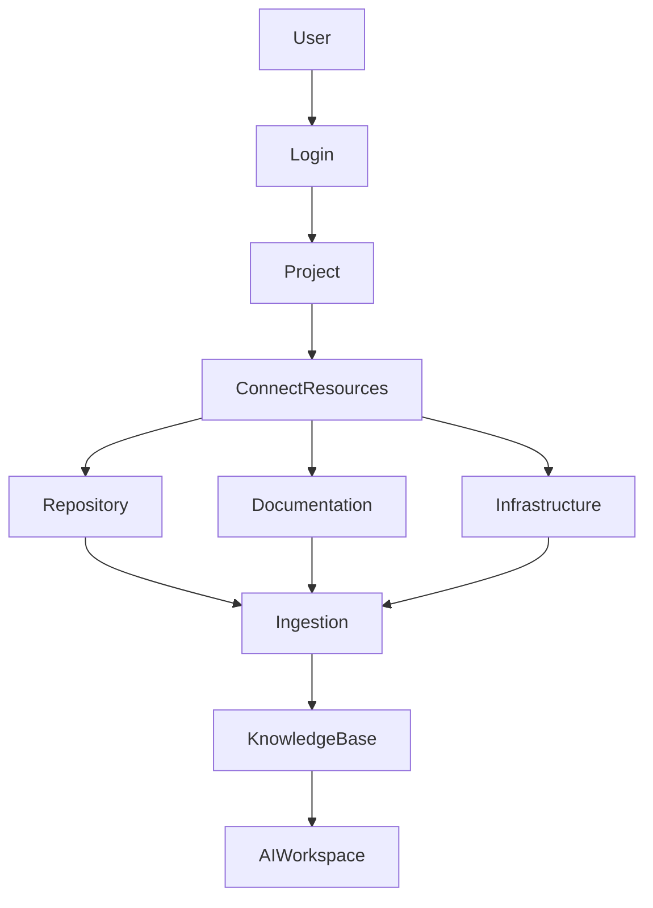
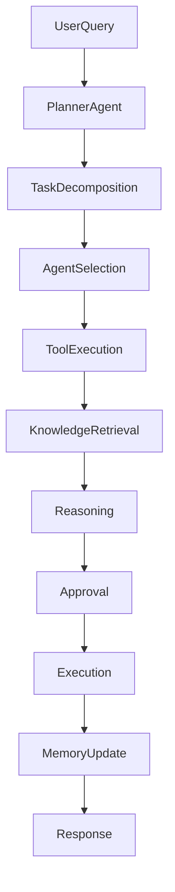
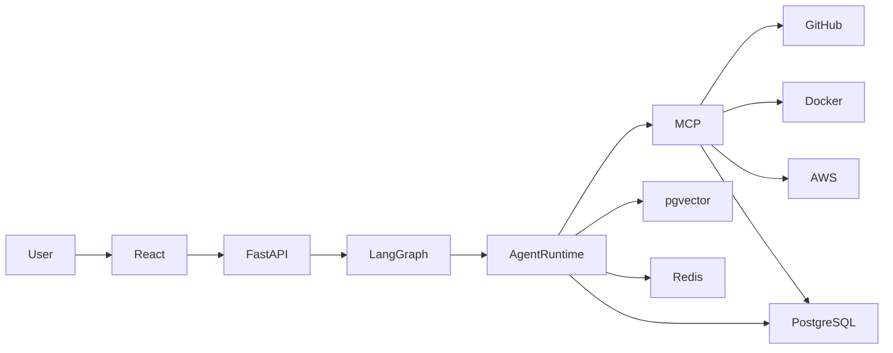

# Aegis AI

**Autonomous Engineering Platform**

---

# 1. Overview

## What is Aegis AI?

Aegis AI is an enterprise-grade AI Engineering Platform that assists software engineers, DevOps engineers, SREs, Platform Engineers, and AI Engineers throughout the software development lifecycle.

Unlike traditional AI chatbots that answer questions, Aegis AI understands repositories, infrastructure, documentation, deployment pipelines, incidents, and engineering workflows. It reasons using multiple specialized AI agents and safely executes engineering tasks through Human-in-the-Loop (HITL) approval.

The long-term vision is to create an AI Engineering teammate capable of assisting with investigation, planning, documentation, code review, deployment analysis, infrastructure understanding, and operational automation.

---

# 2. Vision

Modern engineering teams use dozens of disconnected tools:

* GitHub
* Jira
* Jenkins
* Kubernetes
* Docker
* AWS
* PostgreSQL
* Confluence
* Markdown Documentation
* PDFs
* Log Files

Engineers constantly switch between these systems to understand software, investigate failures, review code, and manage deployments.

Aegis AI unifies these systems into a single AI-powered workspace capable of reasoning over engineering knowledge and performing intelligent actions.

---

# 3. Objectives

The primary objectives are:

* Build a production-quality AI Engineering platform.
* Demonstrate modern Agentic AI architecture.
* Showcase enterprise software engineering practices.
* Provide a real-world engineering assistant.
* Maintain modular and scalable architecture.
* Support future expansion with minimal refactoring.

---

# 4. Target Users

| User                | Primary Benefits                                     |
| ------------------- | ---------------------------------------------------- |
| Software Engineer   | Repository understanding, code review, documentation |
| AI Engineer         | Agent orchestration, RAG, MCP experimentation        |
| DevOps Engineer     | Deployment analysis, Docker, Kubernetes              |
| SRE                 | Incident investigation and root cause analysis       |
| Platform Engineer   | Infrastructure visibility                            |
| Engineering Manager | Project knowledge and engineering insights           |

---

# 5. Core Capabilities

* Multi-Agent AI
* Repository Understanding
* Hybrid RAG
* Engineering Knowledge Base
* Incident Investigation
* Root Cause Analysis
* Infrastructure Analysis
* Documentation Generation
* Code Review
* Memory System
* MCP Tool Integration
* Human Approval Workflows
* Timeline & Audit Trail

---

# 6. Product Workflow



---

# 7. Runtime Workflow



---

# 8. High-Level Architecture



---

# 9. Low-Level Architecture

The platform is composed of the following logical layers:

1. Frontend
2. Backend API
3. Authentication
4. AI Runtime
5. Workflow Engine
6. Agent Runtime
7. Memory Layer
8. Retrieval Layer
9. MCP Tool Layer
10. Infrastructure Integrations

Each layer is independently replaceable and communicates through clearly defined interfaces.

---

# 10. AI Agent Architecture

Core agents:

* Planner Agent
* Knowledge Agent
* Repository Agent
* Infrastructure Agent
* Documentation Agent
* Incident Agent
* Code Review Agent
* Security Agent
* Testing Agent

Each agent contains:

* Responsibilities
* Prompt
* Tool Access
* Memory
* Output Schema

Agents do not communicate directly.

All orchestration is handled by the Workflow Engine.

---

# 11. Memory Architecture

Three memory layers are maintained.

### Short-Term Memory

Current conversation

Workflow state

Execution state

---

### Long-Term Memory

Projects

Repositories

Incidents

Previous fixes

User preferences

---

### Semantic Memory

Embeddings

Vector Search

Knowledge relationships

---

# 12. Knowledge Ingestion Pipeline

Repository

↓

Parser

↓

Chunking

↓

Embedding

↓

Metadata Extraction

↓

Knowledge Storage

↓

Hybrid Retrieval

---

# 13. MCP Integration

Supported integrations include:

* GitHub
* Filesystem
* Docker
* PostgreSQL
* AWS
* Kubernetes (future)
* Browser (future)

Agents interact only with the Tool Registry.

The Tool Registry communicates with MCP servers.

---

# 14. Human-in-the-Loop

Potentially destructive actions always require approval.

Examples:

* Git Push
* Pull Request Creation
* Docker Execution
* Kubernetes Changes
* AWS Changes
* File Deletion
* Database Modification

No external state-changing operation should execute automatically.

---

# 15. Technology Stack

### Frontend

* React
* TypeScript
* TailwindCSS
* ShadCN UI

### Backend

* FastAPI
* Python
* SQLAlchemy
* Alembic

### AI

* LangGraph
* LangChain
* Ollama
* Local LLMs

### Database

* PostgreSQL
* pgvector
* Redis

### Infrastructure

* Docker
* Docker Compose
* GitHub Actions
* AWS

---

# 16. Development Phases

## Phase 1

Project foundation

Authentication

Docker

Database

Frontend shell

Backend shell

---

## Phase 2

Knowledge ingestion

Repository indexing

Document processing

Embeddings

Hybrid Retrieval

---

## Phase 3

Agent Runtime

Planner Agent

Workflow Engine

Memory

---

## Phase 4

MCP Integration

GitHub

Filesystem

Docker

AWS

---

## Phase 5

Engineering Agents

Repository

Knowledge

Infrastructure

Incident

Code Review

---

## Phase 6

Human Approval

Audit Logs

Timeline

Notifications

---

## Phase 7

Frontend Workspace

Chat

Projects

Timeline

Knowledge

Repository Explorer

Approval Queue

---

## Phase 8

Observability

Metrics

Tracing

Monitoring

Performance

---

# 17. Project Principles

* Local-first AI
* Modular Architecture
* Production-quality Code
* Clean Architecture
* SOLID Principles
* Extensible Agent System
* Tool-driven Reasoning
* Human-controlled Execution
* Scalable Design
* Security by Default

---

# 18. Repository Structure

```text
backend/
frontend/
infra/
docs/

README.md
ABOUT.md
AGENTS.md
```

---

# 19. Future Roadmap

* GraphRAG
* Neo4j
* Temporal Workflow Engine
* Kubernetes Integration
* Terraform Integration
* Slack Integration
* Jira Integration
* Multi-tenant SaaS
* RBAC
* Real-time Collaboration
* AI Analytics Dashboard
* Agent Marketplace

---

# 20. Definition of Success

Aegis AI should demonstrate:

* Modern AI Engineering practices
* Production-ready architecture
* Multi-agent orchestration
* Enterprise software engineering
* AI-assisted software lifecycle automation

The project should be suitable as a flagship portfolio application and reflect the standards expected of senior AI engineering teams.
